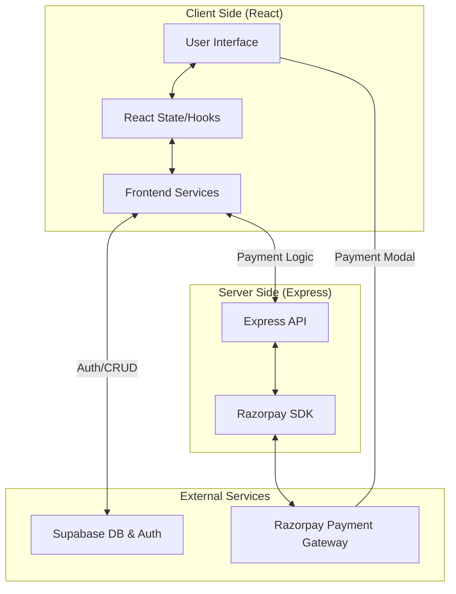

# SPARK - EV Charging Platform

[](https://github.com/spark-ev/spark)
[](https://opensource.org/licenses/MIT)
[](https://github.com/spark-ev/spark)
[](https://reactjs.org/)
[](https://supabase.com/)

**SPARK** is a production-grade, on-demand Electric Vehicle (EV) charging platform. It bridges the gap between EV infrastructure and range anxiety by providing mobile charging vans that come directly to the user's location, managed through a seamless digital experience.

---

## 📖 Table of Contents

- [Overview](#overview)
- [Features](#features)
- [Tech Stack](#tech-stack)
- [System Architecture](#system-architecture)
- [Project Structure](#project-structure)
- [Installation](#installation)
- [Environment Variables](#environment-variables)
- [Usage](#usage)
- [API Documentation](#api-documentation)
- [Database Design](#database-design)
- [Configuration](#configuration)
- [Testing](#testing)
- [Deployment](#deployment)
- [Performance Considerations](#performance-considerations)
- [Security Considerations](#security-considerations)
- [Roadmap](#roadmap)
- [Contributing](#contributing)
- [License](#license)
- [Maintainers](#maintainers)
- [Acknowledgements](#acknowledgements)

---

## 🌟 Overview

### What the project does
SPARK provides an end-to-end solution for EV owners to book mobile charging services. Users can manage their vehicle fleet, request a charge at their current GPS location, track the charging progress, and complete secure payments via Razorpay.

### Problem it solves
The primary hurdle for EV adoption is "range anxiety" and the lack of accessible charging stations. SPARK solves this by bringing the "station" to the user, whether they are at home, work, or stranded on the road.

### Target users
- **EV Owners:** Individual users looking for convenient charging.
- **Fleet Managers:** Businesses managing multiple EVs.
- **Service Providers:** Operators of mobile charging vans.

### Key capabilities
- Real-time geolocation-based charging requests.
- Secure payment processing with automated receipt generation.
- Comprehensive vehicle and booking history management.
- Admin dashboard for monitoring system-wide activity.

---

## 🚀 Features

- **User Authentication:** Secure login and signup powered by Supabase Auth.
- **Vehicle Management:** Add, edit, and track multiple EVs with detailed specifications.
- **On-Demand Booking:** Geolocation-aware booking system with estimated pricing.
- **Razorpay Integration:** Production-ready payment gateway with signature verification and payment method detection.
- **Live Tracking:** Interactive maps using Leaflet for coverage area and service tracking.
- **Automated Receipts:** Dynamic PDF-like receipt generation after successful transactions.
- **Admin Dashboard:** High-level analytics and management interface for platform operators.
- **Responsive Design:** Mobile-first UI built with Tailwind CSS and Framer Motion.

---

## 🛠 Tech Stack

| Layer | Technology |
|-------|------------|
| **Frontend** | React 19, TypeScript, Vite |
| **Backend** | Node.js, Express, TSX |
| **Database** | Supabase (PostgreSQL) |
| **Authentication** | Supabase Auth |
| **Styling** | Tailwind CSS 4, Lucide Icons |
| **Animations** | Framer Motion |
| **Payments** | Razorpay SDK |
| **Maps** | Leaflet, React Leaflet |
| **Infrastructure** | Cloud Run / Vercel |

---

## 🏗 System Architecture

SPARK follows a modern **Client-Server-BaaS** architecture. The React frontend communicates directly with Supabase for data persistence and authentication, while sensitive operations (like payment order creation and verification) are handled by a dedicated Express backend.



### Component Responsibilities
- **Frontend:** Handles UI/UX, client-side routing, and direct Supabase interactions for non-sensitive data.
- **Backend (Express):** Acts as a secure proxy for Razorpay API calls and performs cryptographic signature verification.
- **Supabase:** Manages PostgreSQL database, Row Level Security (RLS), and user sessions.

---

## 📁 Project Structure

```text
.
├── api/                # Express backend (Node.js)
│   └── index.ts        # Main server entry & Razorpay endpoints
├── src/                # React frontend
│   ├── components/     # Reusable UI components (Button, Card, etc.)
│   ├── layouts/        # Page layouts (Dashboard, Auth)
│   ├── pages/          # Page components (Landing, Dashboard, Admin)
│   ├── services/       # API & Supabase service layers
│   ├── utils/          # Helper functions (Location, Formatting)
│   ├── supabaseClient.js # Supabase initialization
│   ├── App.tsx         # Root component & Routing
│   └── main.tsx        # Frontend entry point
├── index.html          # HTML template
├── package.json        # Dependencies & Scripts
├── tsconfig.json       # TypeScript configuration
└── vite.config.ts      # Vite build configuration
```

---

## ⚙️ Installation

### Prerequisites
- Node.js (v18 or higher)
- npm or yarn
- Supabase Project
- Razorpay Account (Test/Live keys)

### Step-by-Step Setup

1. **Clone the repository:**
   ```bash
   git clone https://github.com/spark-ev/spark.git
   cd spark
   ```

2. **Install dependencies:**
   ```bash
   npm install
   ```

3. **Configure Environment Variables:**
   Create a `.env` file in the root directory based on `.env.example`.

4. **Run the development server:**
   ```bash
   npm run dev
   ```
   The app will be available at `http://localhost:3000`.

---

## 🔑 Environment Variables

| Variable | Description | Required |
|----------|-------------|----------|
| `GEMINI_API_KEY` | API Key for Google Gemini AI | No |
| `RAZORPAY_KEY_ID` | Razorpay Public Key | Yes |
| `RAZORPAY_KEY_SECRET` | Razorpay Private Secret | Yes |
| `VITE_RAZORPAY_KEY_ID` | Razorpay Public Key (Client-side) | Yes |
| `APP_URL` | Base URL of the application | Yes |

---

## 📖 Usage

### User Workflow
1. **Onboarding:** Register and complete your profile.
2. **Vehicle Setup:** Add your EV details in the "Vehicles" section.
3. **Booking:** Go to "Book Charging", select your vehicle, and confirm your location.
4. **Payment:** Complete the payment via the Razorpay modal.
5. **Tracking:** Monitor your charging status in the "History" tab.

### Admin Workflow
1. Access `/admin/login`.
2. Monitor active bookings and total revenue on the Admin Dashboard.

---

## 📡 API Documentation

### Payment Endpoints

#### `POST /api/create-order`
Creates a new Razorpay order.
- **Request Body:** `{ amount: number, receipt: string }`
- **Response:** Razorpay Order Object

#### `POST /api/verify-payment`
Verifies the payment signature and fetches payment method.
- **Request Body:** `{ razorpay_order_id, razorpay_payment_id, razorpay_signature }`
- **Response:** `{ success: boolean, payment_method: string }`

#### `GET /api/payment-details/:paymentId`
Fetches detailed information for a specific payment.
- **Response:** `{ success: boolean, payment_method: string, status: string }`

---

## 🗄 Database Design

The system uses Supabase (PostgreSQL) with the following core tables:

- **profiles:** User profile information (linked to `auth.users`).
- **vehicles:** EV fleet data (make, model, battery capacity, registration).
- **bookings:** Charging requests (location, status, energy requested, pricing).
- **payments:** Transaction records (transaction ID, amount, method, status).

---

## 🧪 Testing

Currently, the project uses TypeScript for static type checking.
```bash
# Run type check
npm run lint
```
*Note: Unit and Integration tests (Jest/Cypress) are planned for the next release.*

---

## 🚢 Deployment

### Build Process
The project uses Vite for optimized production builds.
```bash
npm run build
```

### Production Start
The application is designed to run as a unified full-stack app.
```bash
npm start
```
This starts the Express server which serves both the API and the static React assets.

---

## ⚡ Performance Considerations

- **Vite Bundling:** Uses Rollup for efficient code splitting and tree shaking.
- **Supabase Indexing:** Database queries are optimized via PostgreSQL indexes on `user_id` and `status` columns.
- **Tailwind JIT:** Styles are generated on-demand to keep CSS bundles minimal.
- **Lazy Loading:** React components are loaded as needed to reduce initial TTI (Time to Interactive).

---

## 🛡 Security Considerations

- **Row Level Security (RLS):** Supabase RLS policies ensure users can only access their own data.
- **Signature Verification:** HMAC-SHA256 verification for all Razorpay payments on the server side.
- **Environment Isolation:** Sensitive keys are never exposed to the client (except public keys).
- **Input Validation:** Strict TypeScript interfaces for all API payloads.

---

## 🗺 Roadmap

- [ ] Mobile App (React Native)
- [ ] AI-powered charging time prediction
- [ ] Multi-vendor support for charging providers
- [ ] Real-time WebSocket tracking for charging vans
- [ ] Subscription plans for frequent users

---

## 🤝 Contributing

We welcome contributions! Please follow these steps:
1. Fork the Project.
2. Create your Feature Branch (`git checkout -b feature/AmazingFeature`).
3. Commit your Changes (`git commit -m 'Add some AmazingFeature'`).
4. Push to the Branch (`git push origin feature/AmazingFeature`).
5. Open a Pull Request.

---

## 📄 License

Distributed under the MIT License. See `LICENSE` for more information.

---

## 🙏 Acknowledgements

- [Google AI Studio](https://ai.studio)
- [Supabase Documentation](https://supabase.com/docs)
- [Razorpay API Reference](https://razorpay.com/docs/api/)
- [Lucide Icons](https://lucide.dev/)
